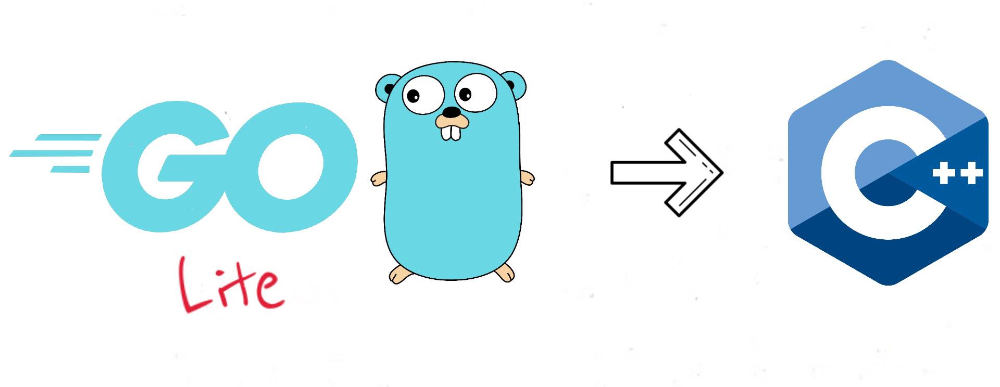

# GoLite Transpiler 💻

<p align="center">
  
</p>

This project is a transpiler that converts goLite (A strict subset of [golang](https://golang.org/)) source code into [C++](http://www.cplusplus.com/) source code.

The transpiler is written in OCaml and the parser was built using **Ocamllex** (which comes with the OCaml distribution) and [**Menhir**](http://gallium.inria.fr/~fpottier/menhir/manual.html) (A scanner generator similar to [bison](https://www.gnu.org/software/bison/manual/bison.html) which is compatible with C)

## GoLite specification 🚀

All supported features for the goLite language are described [**here**](goLite_spec.md)

## Example

The simple binary search goLite program

````go
package main

type l [10]int;

func bin_search(array l, start, end, target int) int {
	if start > end {
		return -1;
	}
	var mid = (end + start)/2;
	if array[mid] == target {
		return mid;
	} else if array[mid] > target {
		return bin_search(array, start, mid - 1, target);
	} else {
		return bin_search(array, mid + 1, end, target);
	}
}

func main() {
	var glist l
	glist[0] = 0
	glist[1] = 3
	glist[2] = 3
	glist[3] = 8
	glist[4] = 9
	glist[5] = 10
	glist[6] = 13
	glist[7] = 14
	glist[8] = 18
	glist[9] = 19

	println(bin_search(glist, 0, 9, 13))
}
````

Is transpiled to

````cpp
#include <array>
#include <iostream>
int bin_search(std::array<int, 10> &array, int start, int end, int target);
int main();
int bin_search(std::array<int, 10> &array, int start, int end, int target) {
    if ((start > end)) {
        return (-1);
    }
    int mid = ((end + start) / 2);
    if ((array[mid] == target)) {
        return mid;
    }
    else {
        if ((array[mid] > target)) {
            return bin_search(array, start, (mid - 1), target);
        }
        else {
            return bin_search(array, (mid + 1), end, target);
        }
    }
}
int main() {
    std::array<int, 10> glist;
    glist[0] = 0;
    glist[1] = 3;
    glist[2] = 3;
    glist[3] = 8;
    glist[4] = 9;
    glist[5] = 10;
    glist[6] = 13;
    glist[7] = 14;
    glist[8] = 18;
    glist[9] = 19;
    std::cout << bin_search(glist, 0, 9, 13) << std::endl;
}

````

More complicated example can be found [here](examples.md)

## How to run it! 🏃‍

**1. Clone the repo**

````
$ git clone https://github.com/vaquierm/GoLite_Transpiler.git
````

**2. Install OCaml**

````
$ sudo apt install ocaml
````

**3. Install opam (to install the testing package)**

````
$ add-apt-repository ppa:avsm/ppa
$ sudo apt install opam
$ opam init
````

**4. Install [ounit](https://github.com/gildor478/ounit)** (for tests)

````
$ opam install ounit2
````

**5. Run all tests** (Hopefully they pass 😟)

````
$ make test
````

**6. Compile the transpiler**

````
$ make
````

**7. Transpile a goLite file** (Insert the filepath of the goLite file you want to transpile into ````<goLite_file>.go````)

````
$ ./goLite_transpiler <goLite_file>.go
````

- If there are syntax or type errors a message will be displayed.
- If everything was fine, a file ````<goLite_file>.cpp```` which contains the translated program will be generated.

**8. Compile and run the C++ file** (if you want)

````
$ g++ <goLite_file>.cpp -o <goLite_file>.out <goLite_file>.cpp
$ ./<goLite_file>.out
````

**9. Clean up the repo** (deletes all build files and generated transpiled files)

````
$ make clean
````

